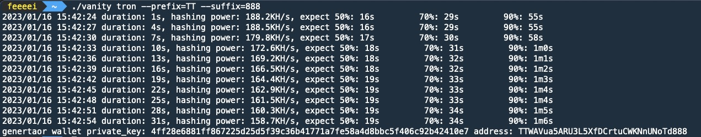

# vanity-generator

`vanity-generator` 是一款基于Go语言实现的区块链钱包靓号生成工具，效率超高，单核可以做到每秒近3w次，多核每秒几十万次。

现支持`ethureum`、`tron`两种网络的钱包生成。

### 特性：
- 纯本地生成，不联网，可作为冷钱包使用
- 基于Go语言实现，生成效率<strong>几十倍</strong>于[前端JS版本](https://vanity-eth.tk/)
- 支持前缀+后缀指定，支持同时指定
- 提供预计耗时，默认提供50%概率、70%概率、90%概率的预计耗时
- 原生高并发支持，默认打满CPU核数

### 使用
命令：`./vanity {eth/tron} --prefix=xxxx --suffix=xxx --concurrency=1`

推荐搭配 `screen` 或者 `nohup` 等命令使用。

### 参数说明
- `--prefix`: 前缀指定，ETH需要 `0x` 开头，Tron需要 `T` 开头。
- `--suffix`: 后缀指定，ETH需要 [0-9A-Fa-f]，Tron需要满足 Base58。
- `--concurrency`: 并发数量，不传递默认等于CPU核数。

