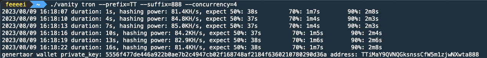

English | [中文](./README_zh-CN.md)

# vanity-generator

`vanity-generator` is a high-efficiency blockchain wallet vanity address generation tool implemented in Go language. With a single core, it can generate nearly 30,000 times per second, and with multiple cores, it can generate hundreds of thousands of times per second. It currently supports wallet generation for Ethereum and Tron networks.

### Features:

- Purely local generation, no internet connection required, can be used as a cold wallet
- 100% based on the official project code of [go-ethereum](https://github.com/ethereum/go-ethereum), providing better security
- Implemented in Go language, generating efficiency is <strong>several tens of times</strong> higher than the [JS version](https://vanity-eth.tk/)
- Supports specifying prefix and suffix, supports specifying both at the same time
- Provides estimated time, default provides estimated time of 50%, 70%, 90% probability
- Native high concurrency support, default uses all CPU cores

### Usage:
Command: `./vanity {eth/tron} --prefix=xxxx --suffix=xxx --concurrency=1`

It is recommended to use with commands such as `screen` or `nohup`.

### Parameter Description:

- `--prefix`: Specify prefix, ETH needs to start with `0x`, Tron needs to start with `T`.
- `--suffix`: Specify suffix, ETH needs to satisfy [0-9A-Fa-f], Tron needs to satisfy Base58.
- `--concurrency`: Number of concurrent processes, if not specified, it is equal to the number of CPU cores by default.